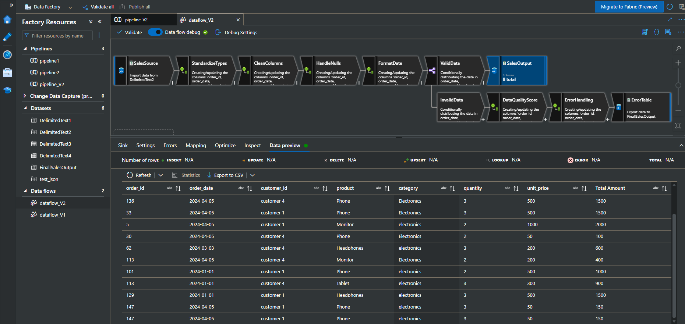
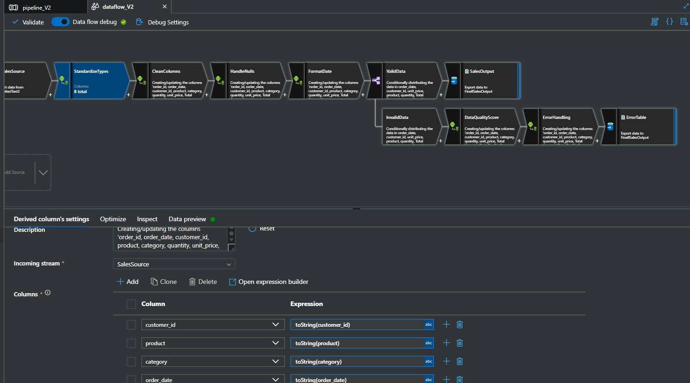
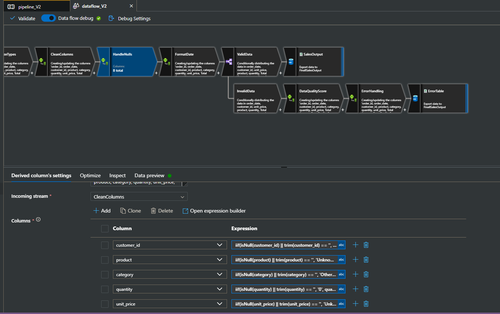
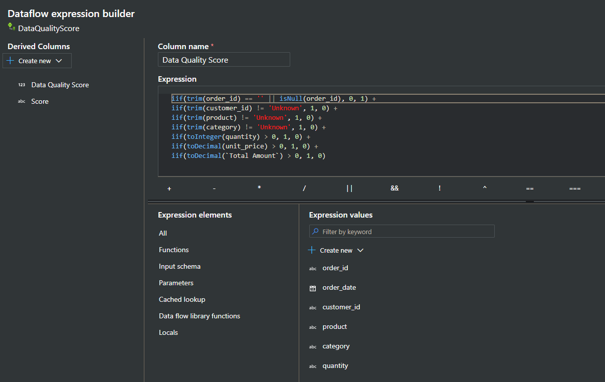
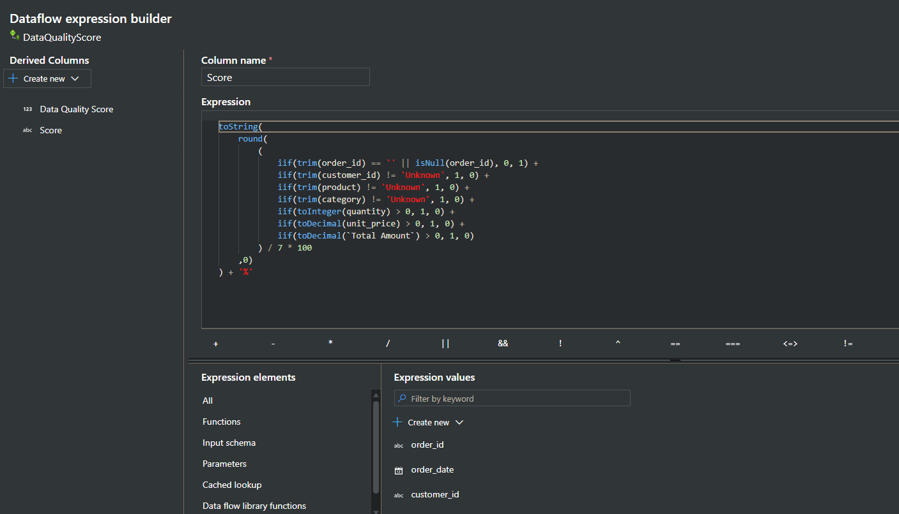
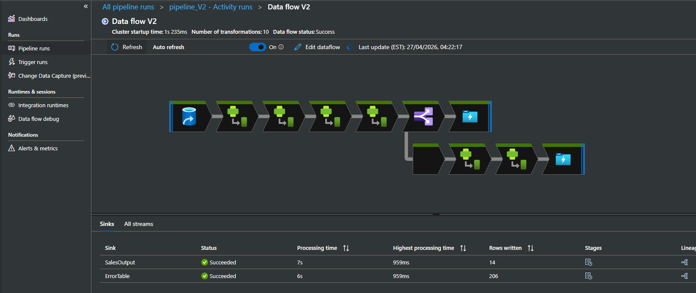
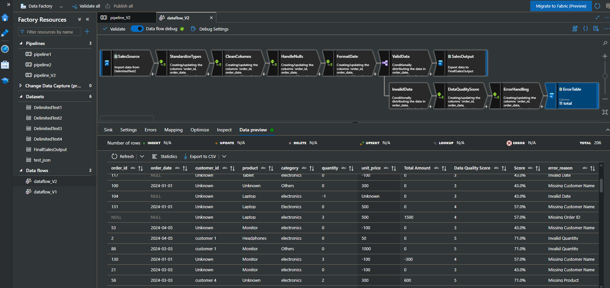

# Azure Data Factory - Sales Data Pipeline
**Developer:** Bishoy Hany Halim 


A production-grade **ETL pipeline** built with **Azure Data Factory (ADF)** that ingests raw sales data, applies multi-stage transformations, scores data quality, and routes records to clean output or an error table based on validation results.

---

## Table of Contents

- [Overview](#overview)
- [Architecture](#architecture)
- [Pipeline Stages](#pipeline-stages)
- [Data Quality Scoring](#data-quality-scoring)
- [Error Handling & Routing](#error-handling--routing)
- [Datasets](#datasets)
- [Execution Results](#execution-results)
- [My Accounts](#my-accounts)

---

## Overview

<p align="center">
  
</p>

This project implements a fully automated sales data pipeline using **Azure Data Factory Mapping Data Flows**. It processes raw delimited sales records through a series of transformations — type standardization, null handling, column cleaning, date formatting, and data quality assessment — before routing each record to either a validated sales output or a flagged error table.

**Key capabilities:**
- Automated ingestion from multiple delimited text sources
- Type-safe column standardization
- Intelligent null/missing value imputation
- Rule-based data quality scoring (0–7 scale, expressed as a percentage)
- Conditional routing of valid vs. invalid records
- Detailed error reason tagging per rejected record

---

## Architecture

```
SalesSource
    │
    ▼
StandardizeTypes        ← Cast all columns to correct data types
    │
    ▼
CleanColumns            ← Normalize customer_id, product, category, etc.
    │
    ▼
HandleNulls             ← Replace nulls/blanks with safe default values
    │
    ▼
FormatDate              ← Standardize order_date format
    │
    ▼
ValidData (Conditional Split)
    ├──► [Valid]   → SalesOutput     → FinalSalesOutput (14 rows written)
    └──► [Invalid] → DataQualityScore → ErrorHandling → ErrorTable (206 rows written)
```

The pipeline contains **10 transformations** and runs two parallel sink outputs.

---

## Pipeline Stages

### 1. `SalesSource`
Ingests raw data from `DelimitedText2`. Source columns include:
`order_id`, `order_date`, `customer_id`, `product`, `category`, `quantity`, `unit_price`, `Total Amount`

### 2. `StandardizeTypes`

<p align="center">
  
</p>

Casts all 8 columns to their appropriate types using `toString()` expressions to ensure downstream expressions operate on consistent types.

| Column | Expression |
|---|---|
| `customer_id` | `toString(customer_id)` |
| `product` | `toString(product)` |
| `category` | `toString(category)` |
| `order_date` | `toString(order_date)` |

### 3. `CleanColumns`

Normalizes customer IDs into a canonical `customer N` format, and replaces blank or null values with `'Unknown'` or `'Others'` for categorical fields.

**Example - `customer_id` normalization logic:**
```
iif(
  isNull(customer_id) || trim(toString(customer_id)) == '',
  'Unknown',
  iif(
    isInteger(replace(replace(toString(customer_id), 'CUST', ''), 'customer', '')),
    concat('customer ', toString(toInteger(replace(replace(...))))),
    'Unknown'
  )
)
```

### 4. `HandleNulls`

<p align="center">
  
</p>

Applies 8 derived column expressions to safely replace null/blank values across all columns:

| Column | Fallback |
|---|---|
| `customer_id` | `'Unknown'` |
| `product` | `'Unknown'` |
| `category` | `'Others'` |
| `quantity` | `'0'` |
| `unit_price` | `'Unknown'` |

### 5. `FormatDate`
Standardizes `order_date` to a consistent date format for downstream compatibility.

### 6. `ValidData` (Conditional Split)

Routes records based on a multi-condition expression:

```
!isNull(order_date) &&
customer_id != 'Unknown' &&
unit_price != 'Unknown' && toInteger(unit_price) > 1 &&
product != 'Unknown' &&
toInteger(quantity) > 1 &&
{Total Amount} != 'Unknown' && toInteger({Total Amount}) > 1
```

Records satisfying all conditions go to **SalesOutput**; all others go to **InvalidData**.

---

## Data Quality Scoring

Invalid records pass through the `DataQualityScore` derived column transformation, which calculates two metrics:

### `Data Quality Score` (integer, 0–7)

<p align="center">
  
</p>

Each of the 7 fields contributes 1 point if it passes validation:

```
iif(trim(order_id) == '' || isNull(order_id), 0, 1) +
iif(trim(customer_id) != 'Unknown', 1, 0) +
iif(trim(product) != 'Unknown', 1, 0) +
iif(trim(category) != 'Unknown', 1, 0) +
iif(toInteger(quantity) > 0, 1, 0) +
iif(toDecimal(unit_price) > 0, 1, 0) +
iif(toDecimal(`Total Amount`) > 0, 1, 0)
```

### `Score` (string, percentage)

<p align="center">
  
</p>

Human-readable percentage representation:

```
toString(round((... sum of 7 checks ...) / 7 * 100, 0)) + '%'
```

**Example scores seen in output:** `43%` (3/7), `57%` (4/7), `71%` (5/7)

---

## Error Handling & Routing

The `ErrorHandling` derived column appends an `error_reason` field to each invalid record using a priority-ordered `iif` chain:

```
iif(isNull(order_id) || trim(order_id) == '',   'Missing Order ID',
iif(isNull(order_date),                          'Invalid Date',
iif(trim(customer_id) == 'Unknown',              'Missing Customer Name',
iif(trim(product) == 'Unknown',                  'Missing Product',
iif(trim(category) == 'Unknown',                 'Missing Category',
iif(toInteger(quantity) <= 0,                    'Invalid Quantity',
iif(toDecimal(unit_price) <= 0,                  'Invalid Unit Price',
iif(toDecimal(`Total Amount`) <= 0,              'Invalid Total Amount',
                                                 'Valid Record'
))))))))
```

**Error reasons observed in output:**
- `Missing Order ID`
- `Invalid Date`
- `Missing Customer Name`
- `Missing Product`
- `Invalid Quantity`

All flagged records are written to `ErrorTable` → `FinalSalesOutput`.

---

## Datasets

| Dataset | Type | Role |
|---|---|---|
| `DelimitedText1` | Delimited CSV | Source (alternate) |
| `DelimitedText2` | Delimited CSV | Primary source |
| `DelimitedText3` | Delimited CSV | Source (alternate) |
| `DelimitedText4` | Delimited CSV | Source (alternate) |
| `FinalSalesOutput` | Delimited CSV | Sink for both outputs |
| `test_json` | JSON | Testing / reference |

---

## Execution Results

<p align="center">
  
</p>

From the latest pipeline run (`pipeline_V2`, 27/04/2026 04:22:17 EST):

| Sink | Status | Rows Written | Processing Time |
|---|---|---|---|
| `SalesOutput` | Succeeded | **14** | 7s |
| `ErrorTable` | Succeeded | **206** | 6s |

- **Cluster startup time:** 1s 235ms  
- **Total transformations:** 10  
- **Data flow status:** Success

### Sample Valid Output (SalesOutput)

<p align="center">
  
</p>

| order_id | order_date | customer_id | product | category | quantity | unit_price | Total Amount |
|---|---|---|---|---|---|---|---|
| 136 | 2024-04-05 | customer 4 | Phone | Electronics | 3 | 500 | 1500 |
| 33 | 2024-04-05 | customer 1 | Phone | Electronics | 3 | 500 | 1500 |
| 5 | 2024-04-05 | customer 1 | Monitor | electronics | 2 | 1000 | 2000 |

### Sample Invalid Output (ErrorTable)

<p align="center">
  
</p>

| order_id | order_date | customer_id | product | Data Quality Score | Score | error_reason |
|---|---|---|---|---|---|---|
| 117 | NULL | Unknown | Tablet | 3 | 43.0% | Invalid Date |
| 100 | 2024-01-01 | Unknown | Unknown | 3 | 43.0% | Missing Customer Name |
| NULL | NULL | Unknown | Laptop | 4 | 57.0% | Missing Order ID |

---

## Getting Started

### Prerequisites
- Azure subscription with **Azure Data Factory** access
- Blob Storage or ADLS Gen2 account for datasets
- ADF Integration Runtime (Auto-resolve or Self-hosted)

---

## My Accounts

[[linkedin](https://www.linkedin.com/in/bishoyhanyhalim/)]
[[Portfolio](https://bishoyhanyhalim.netlify.app/)]
